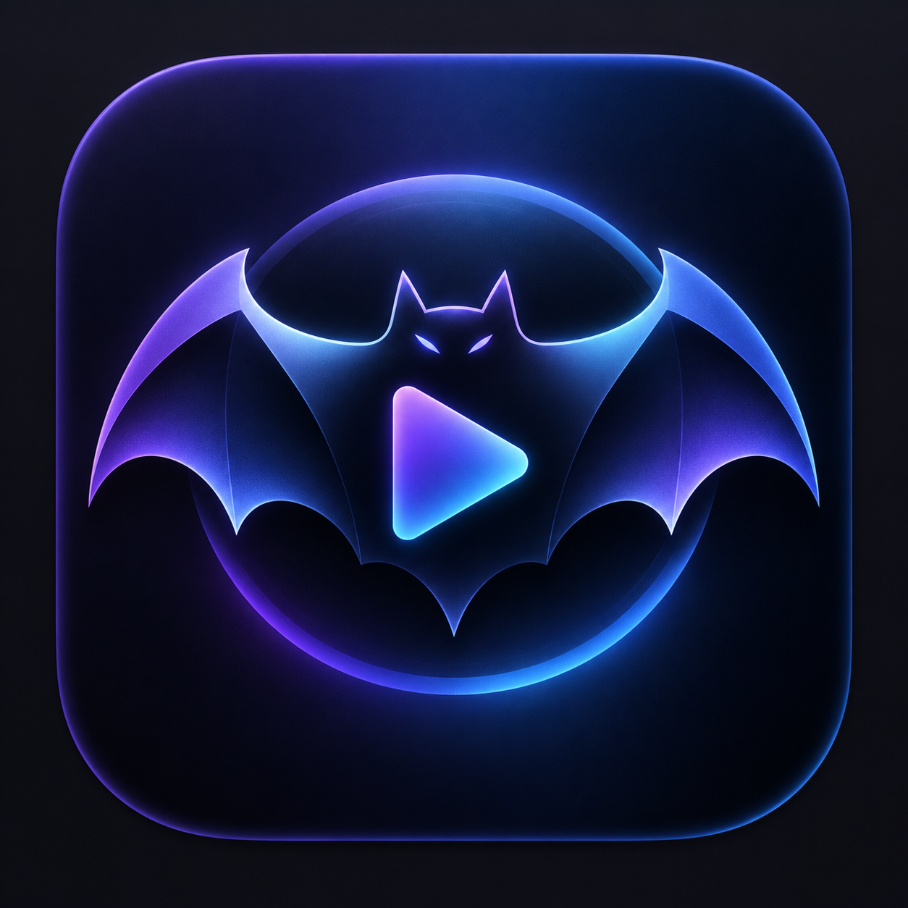

<div align="center">



# BatMediaPlayer

**A modern, lightweight media player for macOS.**

Play your music and videos in a focused listening room with album artwork, metadata, playlists, queue management, and a polished dark interface.

</div>

## Features

- Audio and video playback
- Album artwork and metadata display
- Playlist, queue, and recently played files
- Search, drag and drop, and file association support
- Playback speed and volume controls
- Repeat, shuffle, and A/B loop points
- Subtitle and audio track selection
- Picture-in-Picture video playback
- Floating Mini Player mode
- Dark macOS-native interface
- English and Turkish localization

## Requirements

- macOS 14 or later
- Xcode or Xcode Command Line Tools
- Apple Silicon Mac

## Run locally

From the project directory:

```bash
swift run
```

## Build the app

Create a signed `.app` bundle with:

```bash
./build.sh
```

The application will be created at `build/BatMediaPlayer.app`.

To copy it to Applications:

```bash
cp -R "build/BatMediaPlayer.app" /Applications/
```

## Keyboard shortcuts

| Shortcut | Action |
| --- | --- |
| `⌘ O` | Open files |
| `⌘ ⇧ O` | Add files to playlist |
| `Space` | Play / pause |
| `⌘ ←` | Previous track |
| `⌘ →` | Next track |
| `⌥ ⌘ P` | Picture-in-Picture |
| `⌘ M` | Mini Player |
| `⌘ S` | Capture video frame |

## Project structure

```text
Sources/BatMediaPlayer/
├── Models/       # Media data models
├── Services/     # Metadata, playlist, and file services
├── ViewModels/   # Playback state and application logic
└── Views/        # SwiftUI interface components
```

## License

This project is provided for personal use and development.
